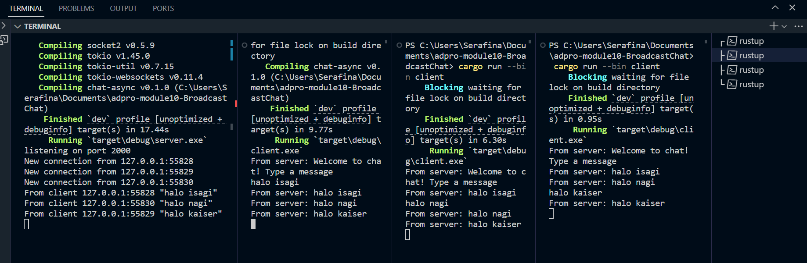

1. I run the server with 

`` cargo run --bin server ``

and the client with 

`` cargo run --bin client ``

The server listens on port 2000 for websocket connections and immediately sends a welcome message when a client connects. Any line entered in a client is sent to the server, which then broadcasts it to all connected clients. Each client prints every broadcast message it receives.

