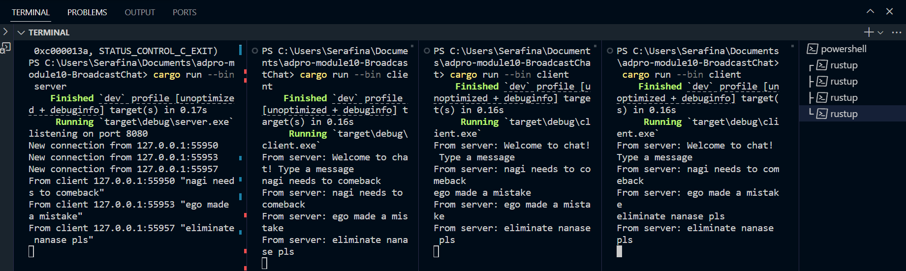
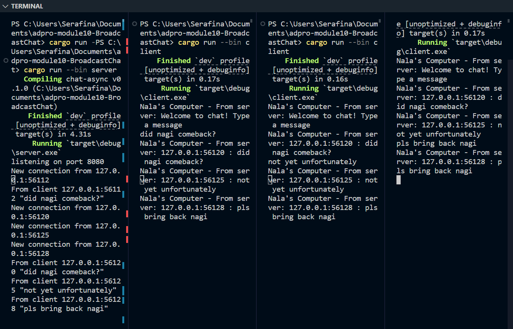

1. I run the server with 

`` cargo run --bin server ``

and the client with 

`` cargo run --bin client ``

The server listens on port 2000 for websocket connections and immediately sends a welcome message when a client connects. Any line entered in a client is sent to the server, which then broadcasts it to all connected clients. Each client prints every broadcast message it receives.

2. I changed the listening address in server.rs from  
``TcpListener::bind("127.0.0.1:2000") `` to  `` TcpListener::bind("127.0.0.1:8080") `` and in client.rs I updated the ``Uri::from_static("ws://127.0.0.1:2000")`` to ``Uri::from_static("ws://127.0.0.1:8080")``

 After restarting server and clients they still connect and exchange messages on port 8080. Both sides use the same ws:// websocket protocol, which is set in the client’s URI and handled by ``ServerBuilder::new().accept(socket)`` on the server. Everything runs smoothly with the new port.

3. I changed the broadcast call in handle_connection to ``format!("{addr} : {text}") `` so every message shows who sent it before it goes out. That change lives right where the server sends messages, ensuring the address is added at the source. In the client’s print statement I prefixed output with `` "Nala's Computer - " `` to clearly mark which machine is displaying the incoming text. These spots are where messages are packaged and shown, so editing there adds context without touching other logic.

